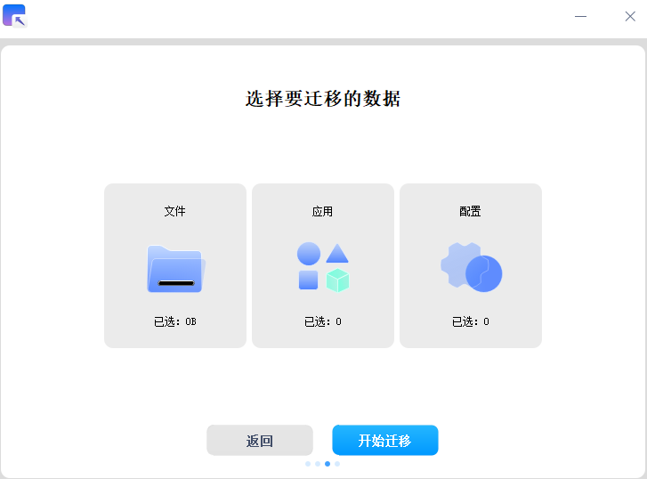
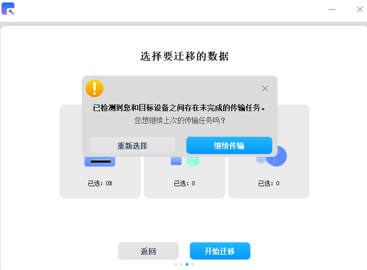
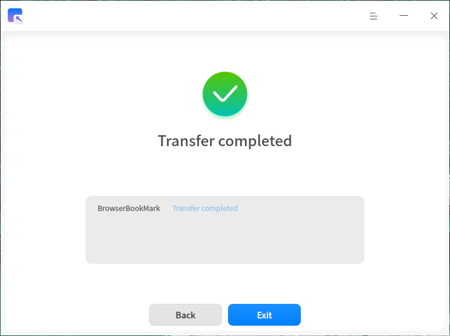

# UOS Migration Tool|deepin-data-transfer|

## Overviews

UOS Migration Tool is a data migration tool that can transfer your personal data and application data from Windows to UOS with one click, providing users a sealess system change experience.

## Establish a connection

To establish a connection, the sender and receiver need to open the UOS migration tool at the same time, enter the UOS IP address and connection password on the Windows side, and click **Connection** to send the request. If the IP address and connection password are entered correctly and the network is unobstructed, the connection is successfully established

**UOS side：**

**Windows side：**

> Note: The sender and receiver devices must be on the same LAN, and only a single device can be connected cooperatively.

## Data preparation

Once the connection is established, the Wait for Transmission page is displayed on the UOS side, and the Migrate Data page is displayed on the Windows side. On Windows, click **Files**, select the files you want to migrate , and click **Confirm**.

**UOS side：**

**Windows side：**

## Data transmission

 Confirming the migration data range on Windows, click Start Migration to transfer data.

> Note: The data that has been transferred will be stored in your home directory.

If the transmission is interrupted by network problems , you can click **continue** to continue the transfer task after the connection is re-established.

## Data migration results

You can view the data migration result on the UOS side after the data is transferred.

