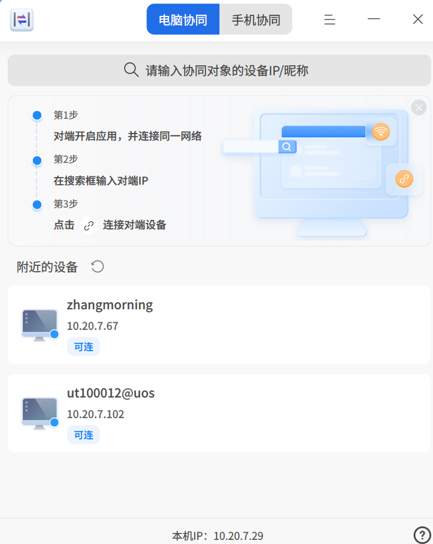

# 跨端协同|dde-cooperation|

### 概述

跨端协同是一款帮助用户在多个设备间进行协同办公的软件，它能在windows和UOS设备之间实现文件投送、键鼠共享、剪贴板共享。

UOS端可通过在**应用商店**中搜索“跨端协同”获取应用；Windows端可访问[https://www.deepin.org/index/assistant](https://www.deepin.org/index/assistant)获取。

### 连接设备

**1. 通过设备列表选择连接设备**

在“跨端协同”应用开启后，设备会自动扫描同一***网段***下的其他设备，被扫描出来的设备会显示在应用的设备列表中，如下图：



找到目标协同设备（可通过计算机名、IP进行识别），点击连接后，完成两台设备的连接。

**2. 通过搜索设备IP连接设备**

在搜索框内，搜索目标协同设备的IP，点击连接后，完成两台设备的连接。

### 文件投送

**1. 通过协同设备列表-文件投送按钮进行投送**

当两台设备处于协同状态下，在设备列表界面点击，在选择文件窗口中，选择需要发送的文件，点击**确定**，即开始文件投送。

**2. 通过文件-右键菜单进行投送**

鼠标右键点击想要发送的文件，选择**发送到-文件投送**，在设备列表中，选择需要投送的目标设备，即开始文件投送。

```
PS：如果是投送到Windows端，需要将Windows端的跨端协同应用保持开启状态。
```

### 键鼠共享

当A、B两台设备处于协同状态时，且B电脑的设置项中键鼠共享开关处于开启时，使用A电脑的鼠标、键盘可直接控制B电脑。鼠标可根据设置项中的屏幕拼接方式在两台电脑的显示屏之间互相穿透。

### 剪贴板共享

当A、B两台设备处于协同状态时，且发起共享的设备设置项中的“剪贴板共享”开关处于开启时，两台电脑将共享一个剪贴板，可以实现在A设备中复制，B设备中粘贴的功能。

### 跨端协同设置

您可以通过点击标题栏选择**设置**进入跨端协同的设置界面。

1. 可被发现

用于控制当前设备是否可被其他同网段下的设备自动搜索，可以选择所有人、不允许。

2. 设备昵称

便于其他设备通过此昵称发现你，设备昵称默认为此设备的计算机名。

3. 外设共享

开启后，允许协同中的另外一台设备的键盘、鼠标、触控板控制此设备。

4. 连接方向

用于控制与协同设备屏幕拼接的位置关系。

5. 允许以下用户向我投送文件

用于控制同一局域网内其他用户向我投送文件的权限，可选择所有人、正在协同的人、不允许。

6. 文件保存位置

设置接收到的文件的储存路径，默认在当前用户下载目录下以对方设备昵称命名的文件夹内。您也可以设置选择其他目录作为默认存储路径。

7. 剪贴板共享

控制是否与协同的设备公用剪贴板。协同的发起方作为服务端，只要发起方开启此功能，双方即共享剪贴板。

### 常见问题

Q：为什么在设备列表中无法发现我的另外一台设备？

A：无法发现设备有以下几种情况，请逐一排查：

1. 设备都需开启“跨端协同”应用，才可以被发现；
2. 设备不在同一局域网，或者在同一个局域网但是不在同一个网段。此种情况下，请先确保两台设备在同一个局域网下，然后在搜索框内搜索目标设备的IP来发现设备；
3. 检查设置-可被发现-“允许同一局域网下的所有人”。

Q：如何判断我的两台设备是否在同一网段下？

A：通常情况下，可以检查IP地址的前三位，如果都一致即在同一网段下。

Q：跨端协同或者文件投送中的数据传输是否安全？

A：数据采用protobuf序列化后SSL/TLS1.3加密传输，保证传输过程数据的安全。


