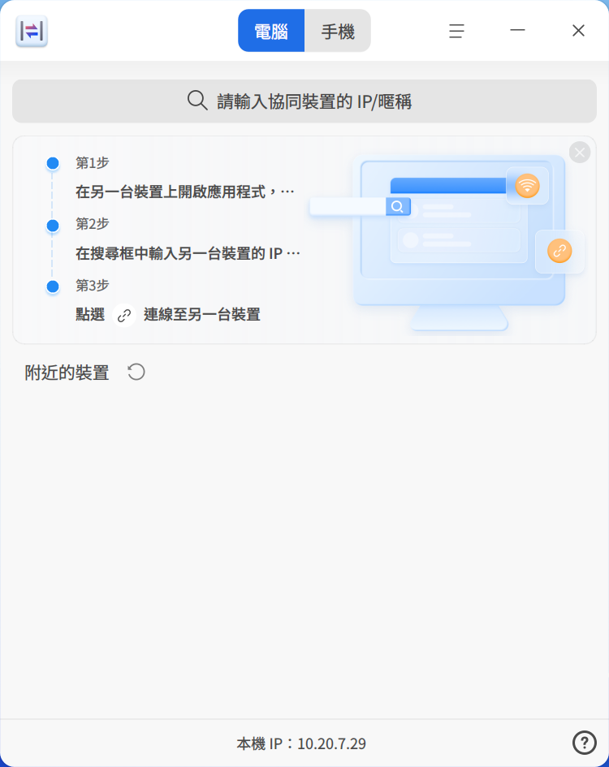

# 跨端協同|dde-cooperation|

### 概述

跨端協同是一款幫助使用者在多個裝置間進行協同辦公的軟體，它能在windows和UOS裝置之間實現文件投送、鍵鼠共享、剪貼簿共享。

UOS端可透過在**應用商店**中搜尋“跨端協同”獲取應用；Windows端可訪問[https://www.chinauos.com/resource/assistant](https://www.chinauos.com/resource/assistant)獲取。

### 連接裝置

**1. 透過裝置列表選擇連接裝置**

在“跨端協同”應用開啟後，裝置會自動掃描同一***網段***下的其他裝置，被掃描出來的裝置會顯示在應用的裝置列表中，如下圖：



找到目標協同裝置（可透過電腦名、IP進行識別），點擊連接後，完成兩台裝置的連接。

**2. 透過搜尋裝置IP連接裝置**

在搜尋框內，搜尋目標協同裝置的IP，點擊連接後，完成兩台裝置的連接。

### 文件投送

**1. 透過協同裝置列表-文件投送按鈕進行投送**

當兩台裝置處於協同狀態下，在裝置列表介面點擊，在選擇文件視窗中，選擇需要發送的文件，點擊**確定**，即開始文件投送。

**2. 透過文件-右鍵選單進行投送**

滑鼠右鍵點擊想要發送的文件，選擇**發送到-文件投送**，在裝置列表中，選擇需要投送的目標裝置，即開始文件投送。

```
PS：如果是投送到Windows端，需要將Windows端的跨端協同應用保持開啟狀態。
```

### 鍵鼠共享

當A、B兩台裝置處於協同狀態時，且B電腦的設定項中鍵鼠共享開關處於開啟時，使用A電腦的滑鼠、鍵盤可直接控制B電腦。滑鼠可根據設定項中的螢幕拼接方式在兩台電腦的螢幕之間互相穿透。

### 剪貼簿共享

當A、B兩台裝置處於協同狀態時，且發起共享的裝置設定項中的“剪貼簿共享”開關處於開啟時，兩台電腦將共享一個剪貼簿，可以實現在A裝置中複製，B裝置中貼上的功能。

### 跨端協同設定

您可以透過點擊標題欄選擇**設定**進入跨端協同的設定介面。

1. 可被發現

用於控制目前裝置是否可被其他同網段下的裝置自動搜尋，可以選擇所有人、不允許。

2. 裝置暱稱

便於其他裝置透過此暱稱發現你，裝置暱稱預設為此裝置的電腦名。

3. 外設共享

開啟後，允許協同中的另外一台裝置的鍵盤、滑鼠、觸控板控制此裝置。

4. 連接方向

用於控制與協同裝置螢幕拼接的位置關係。

5. 允許以下使用者向我投送文件

用於控制同一區域網路內其他使用者向我投送文件的權限，可選擇所有人、正在協同的人、不允許。

6. 文件儲存位置

設定接收到的文件的儲存路徑，預設在目前使用者下載目錄下以對方裝置暱稱命名的資料夾內。您也可以設定選擇其他目錄作為預設儲存路徑。

7. 剪貼簿共享

控制是否與協同的裝置公用剪貼簿。協同的發起方作為服務端，只要發起方開啟此功能，雙方即共享剪貼簿。

### 常見問題

Q：為甚麼在設備列表中無法發現我的另外一台設備？

A：無法發現設備有以下幾種情況，請逐一排查：

1. 設備都需開啟“跨端協同”應用，才可以被發現；
2. 設備不在同一局域網，或者在同一個局域網但是不在同一個網段。此種情況下，請先確保兩台設備在同一個局域網下，然後在搜索框內搜索目標設備的IP來發現設備；
3. 檢查設置-可被發現-“允許同一局域網下的所有人”。

Q：如何判斷我的兩台設備是否在同一網段下？

A：通常情況下，可以檢查IP位址的前三位，如果都一致即在同一網段下。

Q：跨端協同或者文件投送中的數據傳輸是否安全？

A：數據採用protobuf序列化後SSL/TLS1.3加密傳輸，保證傳輸過程數據的安全。


